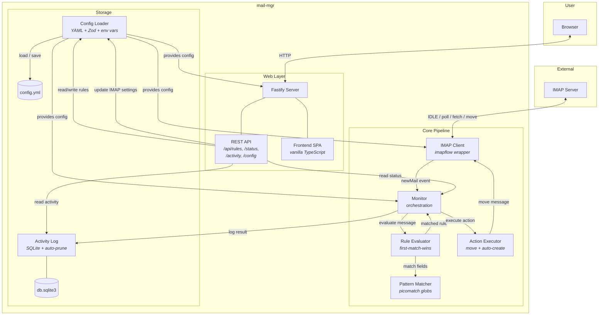

# mail-mgr

An email rule engine that monitors an IMAP mailbox, matches incoming messages against configurable glob-pattern rules, and executes actions like moving messages to folders. Includes a web UI for managing rules, viewing activity, and configuring IMAP settings.

## Table of Contents

- [Installation](#installation)
- [Configuration](#configuration)
- [Development Environment](#development-environment)
- [Testing](#testing)
- [Docker Deployment](#docker-deployment)
- [System Design](#system-design)
- [Components](#components)
- [API Reference](#api-reference)

## Installation

**Prerequisites:** Node.js 22+, npm

```bash
git clone <repo-url>
cd mail-mgr
npm install
```

### Build

```bash
npm run build
```

This runs two stages:
1. `tsc` compiles TypeScript to `dist/`
2. `esbuild` bundles the frontend SPA to `dist/public/app.js`

### Run

```bash
npm start
```

The server starts on `http://localhost:3000` by default. On first run, a default `config.yml` is created in the data directory.

## Configuration

Configuration lives in `$DATA_PATH/config.yml` (defaults to `./data/config.yml`).

```yaml
imap:
  host: imap.example.com
  port: 993
  tls: true
  auth:
    user: you@example.com
    pass: ${IMAP_PASSWORD}
  idleTimeout: 300000    # IDLE cycle interval (ms), default 5 min
  pollInterval: 60000    # Polling fallback interval (ms), default 1 min

server:
  port: 3000
  host: 0.0.0.0

rules: []
```

### Environment Variable Substitution

Any config value can reference environment variables with `${VAR_NAME}` syntax. References are preserved when config is saved through the web UI.

### Environment Variables

| Variable | Description | Default |
|---|---|---|
| `DATA_PATH` | Directory for config.yml and db.sqlite3 | `./data` |
| `IMAP_PASSWORD` | IMAP password (referenced in config) | - |
| `NODE_ENV` | Set to `production` in Docker | - |

### Rule Format

Rules are managed through the web UI or directly in config.yml:

```yaml
rules:
  - id: "auto-generated-uuid"
    name: "Archive newsletters"
    enabled: true
    order: 1
    match:
      sender: "*@newsletter.example.com"    # glob pattern
      recipient: "me@example.com"           # optional
      subject: "*weekly digest*"            # optional
    action:
      type: move
      folder: Newsletters
```

Match fields use glob patterns (via picomatch): `*` matches any characters, `?` matches one character. All specified fields must match (AND logic). Unspecified fields act as wildcards. Rules are evaluated in `order` and first match wins.

## Development Environment

### Setup

```bash
npm install
```

### Dev Server (watch mode)

```bash
npm run dev
```

Uses `tsx watch` to auto-restart on source changes.

### Build Frontend Only

```bash
npm run build:frontend
```

### Project Structure

```
src/
  index.ts              # Entry point
  config/               # YAML config loading with Zod validation
  imap/                 # IMAP client (imapflow), message parsing
  rules/                # Glob pattern matcher, rule evaluator
  actions/              # Action executors (move-to-folder)
  monitor/              # Orchestration pipeline
  log/                  # SQLite activity log
  web/
    server.ts           # Fastify server with SPA fallback
    routes/             # REST API endpoints
    frontend/           # Vanilla TypeScript SPA
test/
  unit/                 # Unit tests (vitest)
  integration/          # Integration tests (GreenMail)
config/
  default.yml           # Default config template
```

### Tech Stack

| Layer | Technology |
|---|---|
| Runtime | Node.js 22 |
| Language | TypeScript 5.9 |
| Web framework | Fastify 5.7 |
| IMAP | imapflow 1.2 |
| Database | SQLite (better-sqlite3) |
| Config validation | Zod |
| Pattern matching | picomatch |
| Logging | pino |
| Frontend | Vanilla TypeScript, esbuild |
| Testing | Vitest, GreenMail |

## Testing

### Unit Tests

```bash
npm test
```

Runs all unit tests via Vitest. Tests cover config loading, glob matching, rule evaluation, action execution, monitor orchestration, IMAP message parsing, activity logging, and web API routes.

Watch mode:

```bash
npm run test:watch
```

### Integration Tests

Integration tests run against a real IMAP server (GreenMail) in Docker. You need Docker installed and running.

**1. Start GreenMail:**

```bash
docker compose -f docker-compose.test.yaml up -d
```

This starts a GreenMail container with SMTP on port 3025 and IMAP on port 3143, with test credentials `user:pass@localhost`.

**2. Run integration tests:**

```bash
npm run test:integration
```

Tests the full pipeline: sending email via SMTP, IMAP monitoring, rule matching, message moving, and activity logging.

**3. Stop GreenMail:**

```bash
docker compose -f docker-compose.test.yaml down
```

### Test Configuration

- `vitest.config.ts` - Unit test config (excludes `test/integration/`)
- `vitest.integration.config.ts` - Integration test config (includes only `test/integration/`)

## Docker Deployment

### Build and Run

```bash
docker compose up -d
```

### With IMAP Password

```bash
IMAP_PASSWORD=your-password docker compose up -d
```

Or create a `.env` file:

```
IMAP_PASSWORD=your-password
```

The Docker setup:
- Multi-stage build (build + runtime) on `node:22-alpine`
- Runs as non-root user `mailmgr`
- Persists data in a named volume at `/data`
- Seeds `config.yml` from the default template on first run
- Exposes port 3000
- Restarts automatically unless stopped

### Stop

```bash
docker compose down
```

## System Design

### Architecture Overview



### Data Flow

1. **IMAP Client** connects to the mail server, opens INBOX, and enters IDLE mode (or falls back to polling if the server doesn't support IDLE).
2. When new mail arrives, the client emits a `newMail` event to the **Monitor**.
3. The Monitor fetches new messages (by UID) and passes each to the **Rule Evaluator**.
4. The Evaluator iterates enabled rules sorted by `order`. The **Pattern Matcher** checks each rule's glob patterns against the message's sender, recipients, and subject. First match wins.
5. If a rule matches, the **Action Executor** performs the action (currently: move to folder). If the target folder doesn't exist, it auto-creates it and retries.
6. Results are recorded in the **Activity Log** (SQLite), which auto-prunes entries older than 30 days.
7. The **Web UI** provides a browser interface to manage rules, view activity, and configure IMAP settings via the REST API.

### Connection Management

The IMAP Client handles connection lifecycle automatically:
- **IDLE cycling:** Sends NOOP every `idleTimeout` ms to keep the connection alive
- **Auto-reconnect:** Exponential backoff from 1s to 60s on disconnect or error
- **Mailbox locking:** Serializes IMAP operations to prevent concurrent mailbox access issues

### Rule Evaluation

```
Message arrives
    │
    ▼
Filter enabled rules, sort by order
    │
    ▼
For each rule:
    ├─ sender pattern specified? → match against from address
    ├─ recipient pattern specified? → match against any to/cc address
    ├─ subject pattern specified? → match against subject
    │
    ▼
All specified fields match? → Return this rule (first match wins)
    │
    ▼
No rules match → Skip message (stays in INBOX)
```

## Components

### Config (`src/config/`)

Loads and validates `config.yml` using Zod schemas. Supports `${ENV_VAR}` substitution in any string value. Preserves env var references when saving config back to disk via atomic writes (temp file + rename).

### IMAP Client (`src/imap/client.ts`)

Wraps the `imapflow` library. Manages connection state (`disconnected` / `connecting` / `connected` / `error`), auto-reconnect with backoff, IDLE support detection, and message operations (fetch, move, create mailbox). Emits events: `connected`, `disconnected`, `error`, `newMail`.

### Message Parser (`src/imap/messages.ts`)

Converts IMAP envelope data into normalized `EmailMessage` objects with typed `EmailAddress` fields (`{name, address}`).

### Pattern Matcher (`src/rules/matcher.ts`)

Uses picomatch for case-insensitive glob matching against message fields. Supports `*`, `?`, and character ranges.

### Rule Evaluator (`src/rules/evaluator.ts`)

Filters enabled rules, sorts by order, returns the first matching rule. AND logic across specified match fields.

### Action Executor (`src/actions/`)

Executes matched rule actions. The `move` action moves a message by UID to the target folder, auto-creating the folder if needed.

### Monitor (`src/monitor/`)

Orchestrates the full pipeline. Connects the IMAP client, listens for new mail events, processes messages through rule evaluation and action execution, and logs results. Serializes message processing to prevent race conditions.

### Activity Log (`src/log/`)

SQLite-backed log of all processed messages and actions. Supports pagination queries for the web UI and auto-prunes entries older than 30 days on a daily schedule. Uses WAL mode for concurrency.

### Web Server (`src/web/server.ts`)

Fastify server that serves the SPA static files and REST API. Non-API routes fall through to `index.html` for client-side routing.

### Frontend SPA (`src/web/frontend/`)

Vanilla TypeScript single-page application with three views: Rules (CRUD + reorder), Activity (paginated log with auto-refresh), and Settings (IMAP config + connection status). Bundled with esbuild.

## API Reference

| Method | Endpoint | Description |
|---|---|---|
| GET | `/api/rules` | List all rules (sorted by order) |
| POST | `/api/rules` | Create a rule |
| PUT | `/api/rules/:id` | Update a rule |
| DELETE | `/api/rules/:id` | Delete a rule |
| PUT | `/api/rules/reorder` | Bulk reorder rules |
| GET | `/api/status` | Connection state, stats |
| GET | `/api/activity?limit=25&offset=0` | Paginated activity log |
| GET | `/api/config/imap` | Current IMAP config (password masked) |
| PUT | `/api/config/imap` | Update IMAP config |
