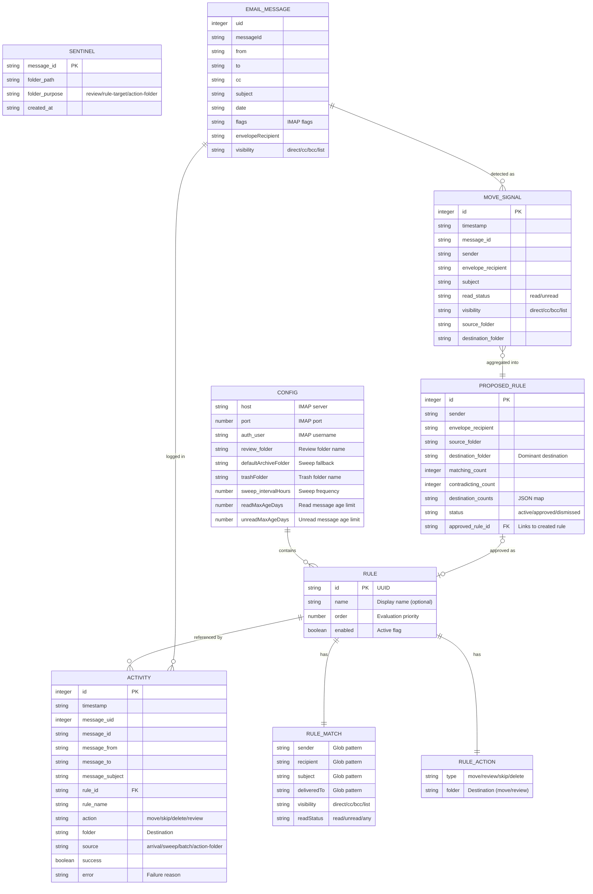
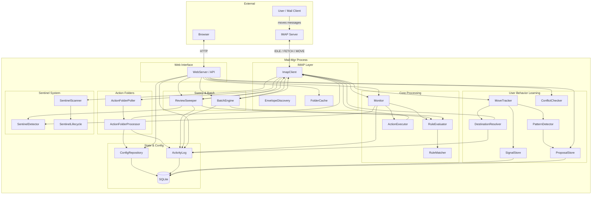
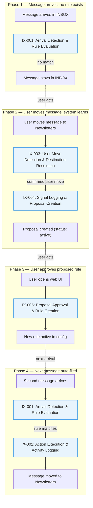
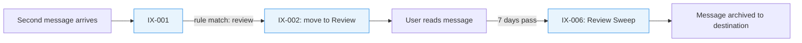
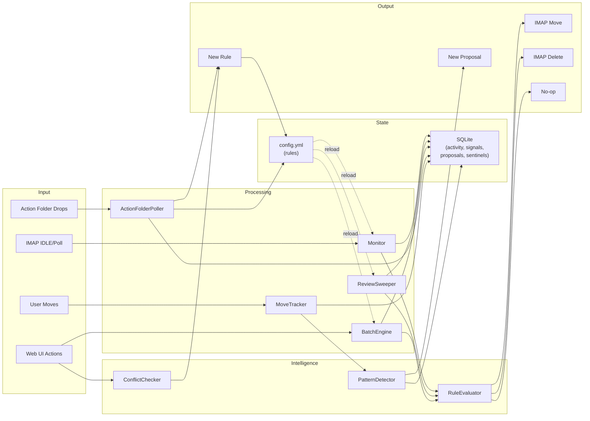

# Mail-Mgr System Architecture

Mail-mgr is a single-process Node.js/TypeScript application that connects to an IMAP server, monitors incoming email, and automatically files messages based on user-defined rules. It learns from user behavior by detecting manual moves and proposing new rules.

## Boundaries

This architecture covers the mail-mgr application itself. Out of scope:

- The upstream IMAP server (Fastmail, Gmail, etc.) — treated as an external dependency.
- Mail clients used by the user — interactions are observed indirectly via IMAP state changes.
- The host OS and container runtime.

---

## Modules

### Core Processing

| Module | Responsibility |
|--------|---------------|
| **Monitor** | Listens for new IMAP messages in INBOX via IDLE (or polling fallback), evaluates rules, executes actions on arrival. The primary message processing loop. |
| **RuleEvaluator** | Evaluates an ordered list of rules against a message. First match wins. Skips rules requiring unavailable envelope data. |
| **RuleMatcher** | Tests a single rule against a message using glob patterns (sender, recipient, subject, deliveredTo) and exact matches (visibility, readStatus). |
| **ActionExecutor** | Executes the matched rule's action: move to folder, move to review, skip, or delete. Auto-creates destination folders on first use. |
| **ReviewSweeper** | Periodically archives aged messages from the Review folder. Read messages swept after `readMaxAgeDays` (default 7), unread after `unreadMaxAgeDays` (default 14). Re-evaluates rules to determine destination. |
| **BatchEngine** | Retroactive rule application: dry-run analysis and bulk filing of existing messages in any folder. Triggered manually via the web UI. |

### User Behavior Learning

| Module | Responsibility |
|--------|---------------|
| **MoveTracker** | Scans tracked folders on a timer (default 30s), detects messages that disappeared, confirms via two-scan protocol, and feeds signals to PatternDetector. |
| **DestinationResolver** | Locates where a moved message ended up. Fast-pass checks recent/common folders; deep-scan (15-min interval) searches all mailboxes by Message-ID. |
| **PatternDetector** | Processes move signals into proposals. Tracks per-sender destination counts, computes dominant destination, and auto-resurfaces dismissed proposals after 5 new signals. |
| **SignalStore** | SQLite persistence for raw user-move signals (sender, destination, visibility, read status). |
| **ProposalStore** | SQLite persistence for detected patterns. Tracks match/contradict counts, status (active/approved/dismissed), and links to approved rules. |
| **ConflictChecker** | Detects exact-match and shadow conflicts when a user attempts to approve a proposal, preventing duplicate or unreachable rules. |

### Action Folders

| Module | Responsibility |
|--------|---------------|
| **ActionFolderPoller** | Polls four IMAP action folders (VIP, Block, Undo-VIP, Unblock) on a timer (default 15s) for messages the user has dragged in. See IX-007. |
| **ActionFolderProcessor** | Processes action folder messages: creates or removes rules, handles conflicts and duplicates idempotently, moves the message to its final destination. See IX-008. |

### Configuration & State

| Module | Responsibility |
|--------|---------------|
| **ConfigRepository** | Manages the YAML config file. Provides rule CRUD, config section updates, and change listeners that trigger subsystem reloads. |
| **ActivityLog** | SQLite database recording all system actions (arrivals, sweeps, batches, action-folder ops). Auto-prunes entries older than 30 days. Also stores persistent state (lastUid cursor). |

### IMAP & Infrastructure

| Module | Responsibility |
|--------|---------------|
| **ImapClient** | Abstraction over imapflow: connect/disconnect, fetch/move/delete messages, create mailboxes, IDLE support with polling fallback, exponential backoff reconnect. |
| **EnvelopeDiscovery** | Probes the IMAP server at startup for custom envelope header support (e.g., Delivered-To). Persists discovered header name to config. |
| **FolderCache** | TTL-based cache (default 5 min) of the IMAP folder tree to reduce LIST commands. |
| **SentinelDetector** | Tests whether a message is a system-planted sentinel via the `X-Mail-Mgr-Sentinel` header. Guards every processing boundary. |
| **SentinelScanner** | Periodically verifies all tracked sentinel messages still exist in expected folders; triggers SentinelHealer on discrepancies. |
| **SentinelLifecycle** | Reconciles which folders need sentinels based on current config (rules, review, action folders) and plants or removes them accordingly. |

### Web Interface

| Module | Responsibility |
|--------|---------------|
| **WebServer** | Fastify HTTP server serving the SPA frontend and REST API routes for rules, activity, status, config, proposals, batch operations, and folder listing. |

---

## Entity Relationships

---

## Component Map

---

## Integration Chains

Detailed sequence diagrams for each integration live in the `integrations/` spec files. This section shows how integrations chain together to fulfill use cases.

### UC-001: Manual move → proposed rule → auto-filing

### UC-001.c Variant: Review sweep delayed filing

---

## Data Flow Overview

