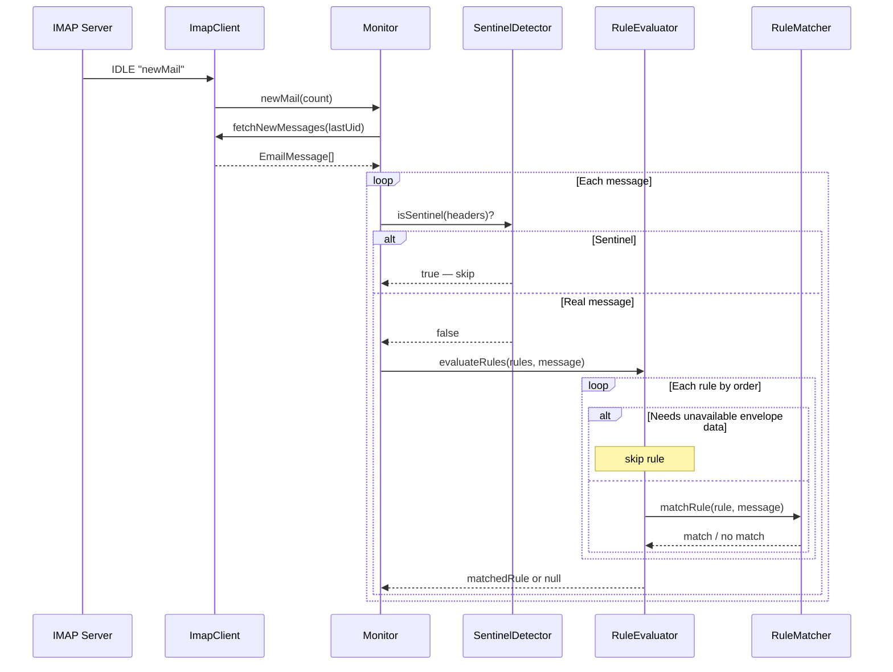

## Participants

- **ImapClient** — receives IDLE/poll events and fetches new messages by UID.
- **Monitor** — orchestrates the arrival pipeline: fetch, guard, evaluate, delegate.
- **SentinelDetector** — guards against processing system-planted sentinel messages.
- **RuleEvaluator** — iterates rules in order, returns first match.
- **RuleMatcher** — tests a single rule's match fields against message data using glob patterns.

## Named Interactions

- **IX-001.1** — IDLE newMail event triggers Monitor to fetch messages with UIDs greater than lastUid.
- **IX-001.2** — Each fetched message is checked against SentinelDetector; sentinel messages are logged and skipped.
- **IX-001.3** — Non-sentinel messages are passed to RuleEvaluator, which iterates enabled rules sorted by order.
- **IX-001.4** — RuleEvaluator skips rules requiring envelope data (deliveredTo, visibility) when envelope discovery has not found a supported header.
- **IX-001.5** — RuleMatcher tests each rule's match fields (sender, recipient, subject, deliveredTo, visibility, readStatus) using AND logic; all specified fields must match.
- **IX-001.6** — First matching rule is returned; if no rules match, null is returned and the message stays in INBOX.
- **IX-001.7** — Monitor updates the lastUid cursor in persistent state after processing each message.

## Sequence Diagram

## Preconditions

- ImapClient is connected and IDLE (or polling) on INBOX.
- At least one message arrives with a UID greater than the persisted lastUid.
- Rules are loaded from ConfigRepository.

## Postconditions

- Each message has been evaluated against all applicable rules.
- The result is either a matched rule (handed off to IX-002) or null (message remains in INBOX).
- lastUid is updated to reflect the most recently processed message.
- Sentinel messages are skipped without rule evaluation.

## Failure Handling

None defined yet.
