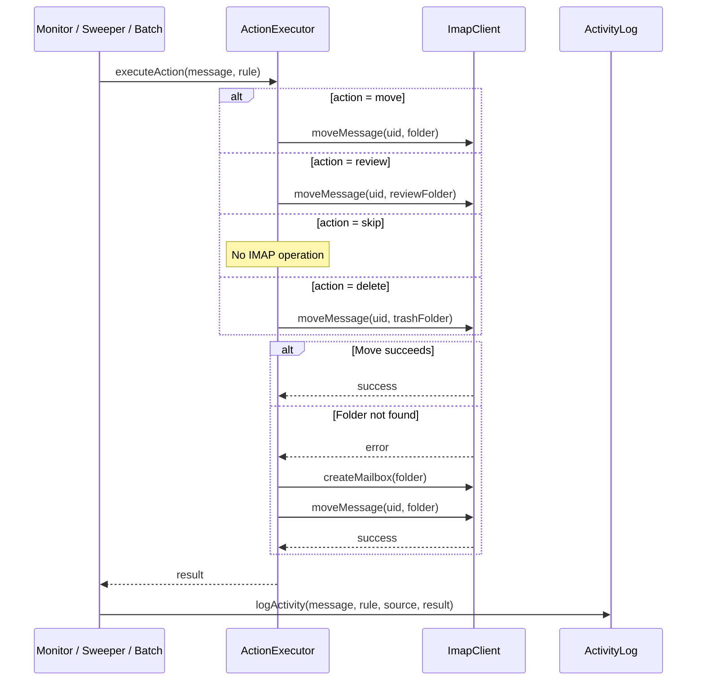

## Participants

- **Monitor** (or **ReviewSweeper** / **BatchEngine**) — the caller that received a matched rule from RuleEvaluator.
- **ActionExecutor** — performs the IMAP operation corresponding to the rule's action type.
- **ImapClient** — executes the actual IMAP MOVE or folder creation.
- **ActivityLog** — records the outcome (success or failure) to SQLite.

## Named Interactions

- **IX-002.1** — ActionExecutor receives the message, matched rule, and source context (arrival/sweep/batch).
- **IX-002.2** — For `move` actions: ImapClient moves the message to the rule's destination folder.
- **IX-002.3** — For `review` actions: ImapClient moves the message to the review folder (or a rule-specified override folder).
- **IX-002.4** — For `skip` actions: no IMAP operation is performed.
- **IX-002.5** — For `delete` actions: ImapClient moves the message to the trash folder.
- **IX-002.6** — If the destination folder does not exist, ImapClient auto-creates it and retries the move.
- **IX-002.7** — ActivityLog records the result: timestamp, message metadata, rule ID/name, action taken, destination folder, source, and success/error status.

## Sequence Diagram

## Preconditions

- A rule has been matched by RuleEvaluator (IX-001 or IX-006).
- The message UID is valid within the current IMAP session.

## Postconditions

- The message is in its destination folder (move/review/delete) or remains in place (skip).
- An activity log entry exists recording the action, outcome, and metadata.
- If the destination folder was auto-created, it persists for future moves.

## Failure Handling

None defined yet.
