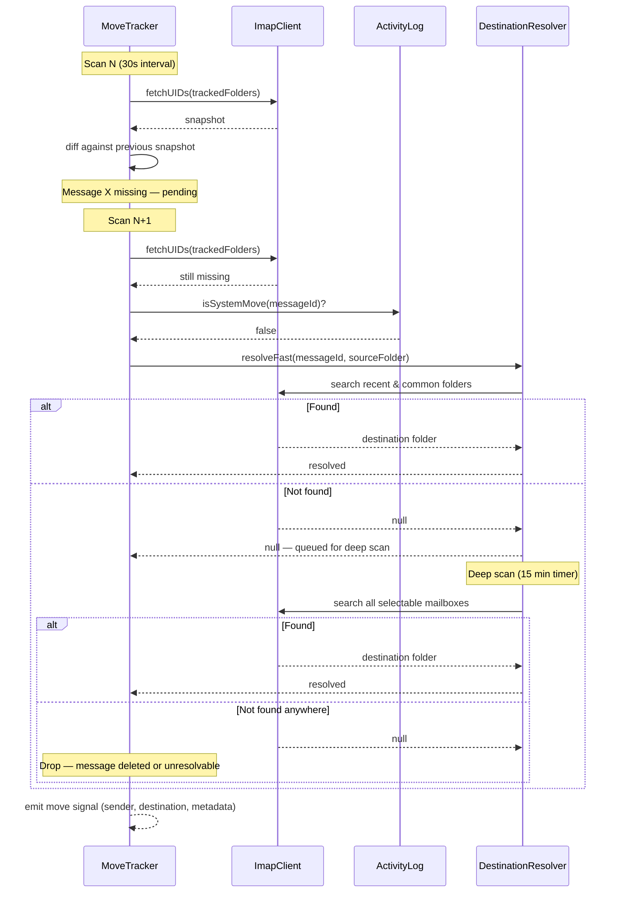

## Participants

- **MoveTracker** — scans tracked folders on a timer, detects disappearances, confirms via two-scan protocol.
- **ImapClient** — provides UID snapshots of folder contents and message search by Message-ID.
- **ActivityLog** — consulted to distinguish system-initiated moves from user moves.
- **DestinationResolver** — locates where the message ended up using fast-pass and deep-scan strategies.

## Named Interactions

- **IX-003.1** — MoveTracker takes a UID snapshot of tracked folders and compares against the previous snapshot. Messages present before but missing now are marked as pending disappearances.
- **IX-003.2** — On the next scan (two-scan confirmation), MoveTracker verifies the message is still absent. This prevents false positives from transient IMAP states or concurrent system operations.
- **IX-003.3** — MoveTracker queries ActivityLog to check whether the disappearance was caused by a system-initiated move (arrival, sweep, batch, action-folder). System moves are excluded.
- **IX-003.4** — For confirmed user moves, DestinationResolver attempts fast-pass resolution: searching recent folders (from activity log) and common folder names for the message by Message-ID.
- **IX-003.5** — If fast-pass fails, the message is queued for deep-scan resolution on the 15-minute timer, which searches all selectable mailboxes by Message-ID.
- **IX-003.6** — Once the destination is resolved, MoveTracker emits a confirmed move signal with full metadata (sender, envelope recipient, subject, visibility, read status, source folder, destination folder) for downstream processing by IX-004.
- **IX-003.7** — If deep-scan also fails to locate the message (e.g., permanently deleted), the pending entry is dropped with no signal emitted.

## Sequence Diagram

## Preconditions

- MoveTracker is running and has a previous UID snapshot for at least one tracked folder.
- A user has manually moved a message via their mail client.

## Postconditions

- Confirmed user moves produce a signal with sender, destination, and message metadata.
- System-initiated moves are excluded and produce no signal.
- Failed resolutions (message not found anywhere) are silently dropped.
- Two-scan confirmation prevents false positives from transient states.

## Failure Handling

None defined yet.
