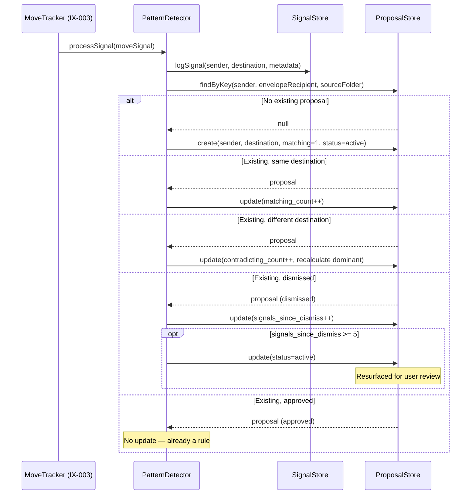

## Participants

- **PatternDetector** — receives move signals from MoveTracker and drives proposal upsert logic.
- **SignalStore** — persists raw move signals to SQLite for historical analysis.
- **ProposalStore** — persists detected patterns as proposals, tracking match/contradict counts and status.

## Named Interactions

- **IX-004.1** — PatternDetector receives a confirmed move signal (from IX-003) containing sender, envelope recipient, source folder, destination folder, and message metadata.
- **IX-004.2** — SignalStore persists the raw signal with all metadata (sender, envelope recipient, subject, visibility, read status, source/destination folders, timestamp).
- **IX-004.3** — PatternDetector builds a proposal key from {sender, envelopeRecipient, sourceFolder} and queries ProposalStore for an existing proposal.
- **IX-004.4** — If no existing proposal: ProposalStore creates a new proposal with status `active`, matching_count=1, the destination as the dominant destination.
- **IX-004.5** — If an existing active proposal with the same destination: matching_count is incremented. The proposal's strength label progresses (Weak → Moderate → Strong) as count grows.
- **IX-004.6** — If an existing active proposal with a different destination: contradicting_count is incremented and destination_counts is updated. The dominant destination may shift if the new destination overtakes the previous one.
- **IX-004.7** — If an existing dismissed proposal: signals_since_dismiss is incremented. Once it reaches 5, the proposal is automatically reactivated to status `active`, giving the user another chance to review it.
- **IX-004.8** — If an existing approved proposal: no update is performed (the pattern is already captured as a rule).

## Sequence Diagram

## Preconditions

- A confirmed move signal has been emitted by IX-003 with a resolved destination.

## Postconditions

- The raw signal is persisted in SignalStore.
- A proposal exists in ProposalStore reflecting the current pattern state for this sender/source combination.
- Proposal counts accurately reflect the cumulative history of moves for this sender.

## Failure Handling

None defined yet.
