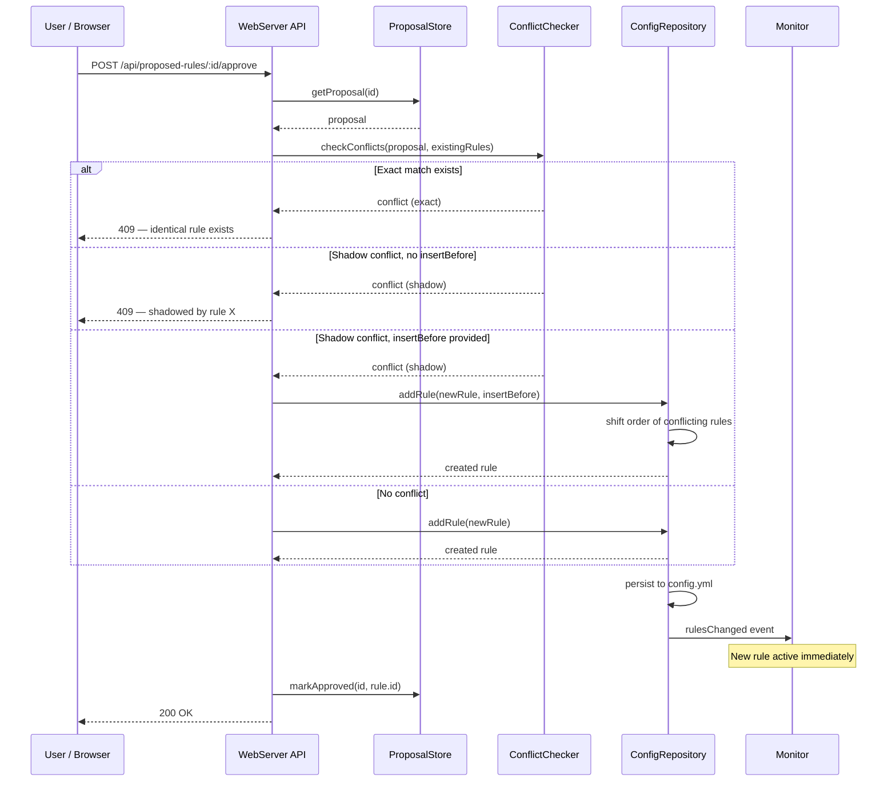

## Participants

- **WebServer API** — receives the approval request from the user's browser.
- **ProposalStore** — provides the proposal data and updates its status on approval.
- **ConflictChecker** — detects exact-match and shadow conflicts between the proposed rule and existing rules.
- **ConfigRepository** — creates the new rule, persists to YAML, and notifies change listeners.
- **Monitor** — receives the rules-changed event and immediately picks up the new rule for future evaluations.

## Named Interactions

- **IX-005.1** — User requests `POST /api/proposed-rules/:id/approve`. WebServer retrieves the proposal from ProposalStore.
- **IX-005.2** — ConflictChecker evaluates the proposal against all existing rules for exact-match conflicts (identical sender + recipient + folder).
- **IX-005.3** — ConflictChecker evaluates for shadow conflicts: an existing rule with a broader pattern at higher priority that would catch the same messages, making the new rule unreachable.
- **IX-005.4** — If an exact match exists, the request is rejected with a 409 Conflict response.
- **IX-005.5** — If a shadow conflict exists and no `insertBefore` parameter is provided, the request is rejected with a 409 explaining which rule shadows the proposal.
- **IX-005.6** — If a shadow conflict exists and `insertBefore` is provided, ConfigRepository inserts the new rule at the specified position and shifts the conflicting rule (and those at or above it) by +1 order.
- **IX-005.7** — If no conflicts exist, ConfigRepository creates the new rule with match fields from the proposal (sender, optionally envelope recipient), the proposal's destination as the move action folder, and the next available order value.
- **IX-005.8** — ConfigRepository persists the updated rules to config.yml and fires the rulesChanged listener, which causes Monitor (and Sweeper, BatchEngine) to reload their rule sets immediately.
- **IX-005.9** — ProposalStore marks the proposal as `approved` with a reference to the created rule's ID.

## Sequence Diagram

## Preconditions

- An active proposal exists in ProposalStore.
- The user is authenticated to the web UI (or has API access).

## Postconditions

- On success: a new rule exists in config.yml, the proposal is marked `approved`, and all processing subsystems have reloaded the rule set.
- On conflict: no rule is created, no proposal status change, user receives actionable error information.

## Failure Handling

None defined yet.
