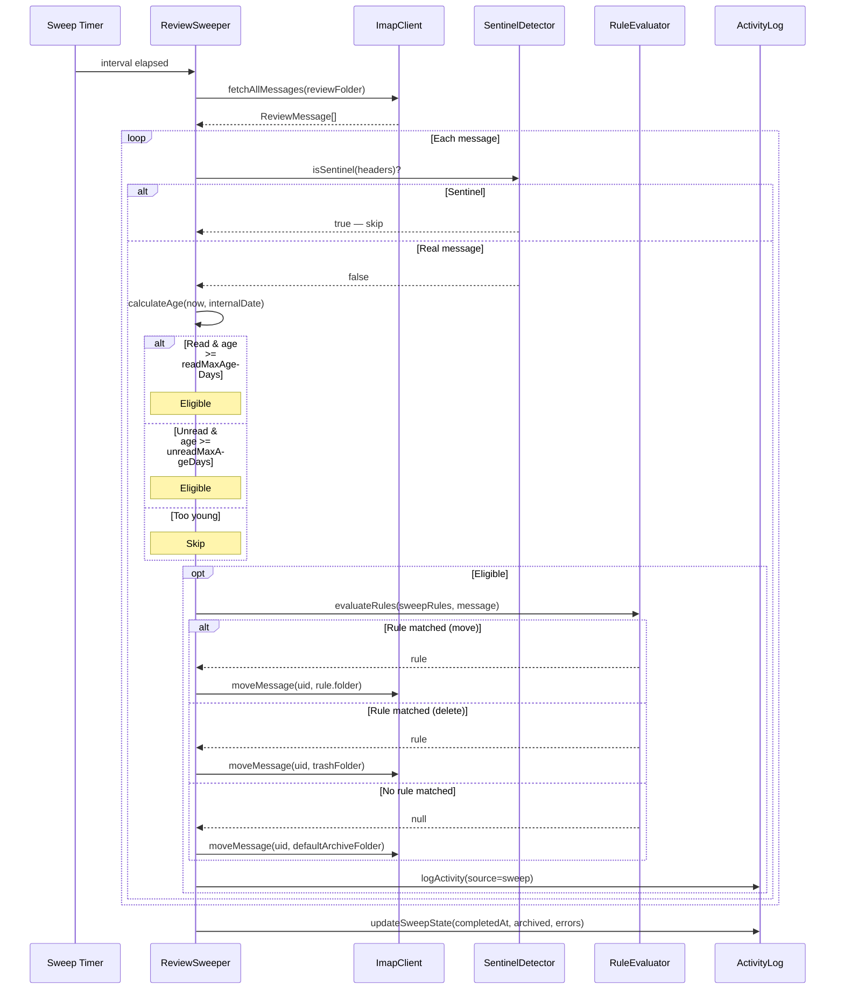

## Participants

- **ReviewSweeper** — orchestrates the sweep cycle on a configurable timer (default every 6 hours, 30s initial delay).
- **ImapClient** — fetches all messages from the Review folder and executes moves.
- **SentinelDetector** — guards against processing sentinel messages during sweep.
- **RuleEvaluator** — re-evaluates rules against eligible messages to determine destination (using the same first-match-wins logic as arrival processing, but excluding skip and bare review actions).
- **ActivityLog** — records sweep actions and updates sweep state (lastSweep timestamp, counts).

## Named Interactions

- **IX-006.1** — Sweep timer fires (or manual trigger). ReviewSweeper fetches all messages from the configured review folder.
- **IX-006.2** — Each message is checked against SentinelDetector; sentinels are skipped.
- **IX-006.3** — For each non-sentinel message, eligibility is calculated from message age (now minus internalDate). Read messages (\\Seen flag) are eligible after `readMaxAgeDays` (default 7). Unread messages are eligible after `unreadMaxAgeDays` (default 14).
- **IX-006.4** — Ineligible messages (too young) are skipped.
- **IX-006.5** — For eligible messages, RuleEvaluator evaluates the sweep-filtered rule set (skip rules and review-without-folder rules are excluded, since those would create loops).
- **IX-006.6** — If a rule matches: the message is moved to the rule's destination folder (move action) or trash (delete action).
- **IX-006.7** — If no rule matches: the message is moved to `defaultArchiveFolder` (default "MailingLists").
- **IX-006.8** — Each move/delete is logged to ActivityLog with source `sweep`, including the matched rule (if any) and destination.
- **IX-006.9** — After processing all messages, ReviewSweeper updates sweep state: completedAt timestamp, messagesArchived count, error count, and computes nextSweepAt.

## Sequence Diagram

## Preconditions

- ReviewSweeper is running and the review folder exists.
- Sweep configuration is loaded (intervalHours, readMaxAgeDays, unreadMaxAgeDays, defaultArchiveFolder).
- At least one message exists in the review folder.

## Postconditions

- All eligible messages have been moved out of the review folder to their resolved destinations.
- Ineligible messages remain in the review folder untouched.
- Activity log contains entries for each swept message.
- Sweep state reflects the completed run (timestamp, counts).

## Failure Handling

- **FM-001** — The sweep tick must not strand IDLE on the review folder. ReviewSweeper performs its folder work via `MOD-0002.withMailboxSwitch`, which is responsible for re-selecting INBOX and re-arming IDLE in its `finally` block. INV-001 captures the underlying property.
