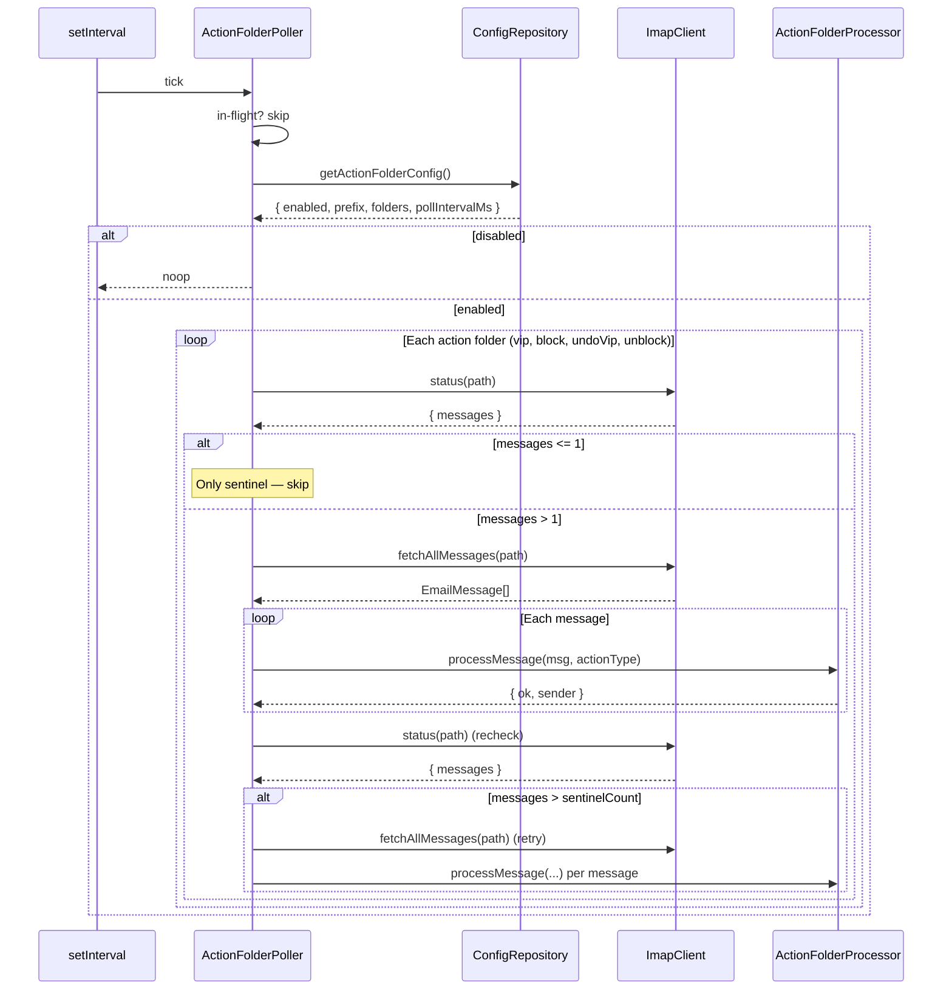

## Participants

- **ActionFolderPoller** (MOD-0017) — runs on a fixed timer, scans each action folder for new messages, and dispatches them to the processor.
- **ConfigRepository** (MOD-0014) — provides the action-folder configuration (enabled flag, prefix, folder names per action type, poll interval).
- **ImapClient** (MOD-0002) — performs the IMAP `STATUS` and `FETCH` operations against each action folder.
- **SentinelDetector** (MOD-0003) — used downstream by the processor to filter out the sentinel that lives in each action folder.
- **ActionFolderProcessor** (MOD-0018) — receives each fetched message and the resolved action type. Detailed behavior is covered by IX-008.

## Named Interactions

- **IX-007.1** — Polling timer fires at the configured interval (default 15s); ActionFolderPoller short-circuits if a previous scan is still in flight (single-flight guard).
- **IX-007.2** — Poller reads the action-folder config from ConfigRepository; if `enabled` is false, the scan exits without touching IMAP.
- **IX-007.3** — Poller resolves the four IMAP folder paths (`<prefix>/<vipFolder>`, `<prefix>/<blockFolder>`, `<prefix>/<undoVipFolder>`, `<prefix>/<unblockFolder>`) and the matching ActionType for each (`vip`, `block`, `undoVip`, `unblock`).
- **IX-007.4** — For each action folder, Poller calls `ImapClient.status(path)` to get the message count; counts of 0 (sentinel missing) or 1 (sentinel only) are skipped without fetching.
- **IX-007.5** — When count > 1, Poller calls `ImapClient.fetchAllMessages(path)` to retrieve every message in the folder, then hands each message to ActionFolderProcessor along with the folder's ActionType.
- **IX-007.6** — Processor's sentinel guard is invoked for every dispatched message; sentinel hits are reported back so the poller can distinguish "expected residue" (sentinels) from "messages that failed to leave the folder".
- **IX-007.7** — After processing, Poller re-checks the folder via `ImapClient.status(path)`; if the count exceeds the known sentinel count, it logs a warning and performs a single retry pass over any remaining messages.
- **IX-007.8** — Errors from any single folder are logged and isolated; the scan continues to the next folder rather than aborting the whole tick.

## Sequence Diagram

## Preconditions

- ImapClient is connected to the IMAP server.
- The four action folders exist under the configured prefix and each contains a sentinel.
- ConfigRepository has been initialized and exposes a current `actionFolders` config section.

## Postconditions

- Every non-sentinel message that was in any action folder at the start of the tick has been dispatched to ActionFolderProcessor at least once.
- Each action folder's residual message count is either equal to its sentinel count, or a warning has been logged describing the leftover.
- Processing of one folder's failure does not prevent the remaining folders from being scanned.

## Failure Handling

- **FM-001** — Each per-folder scan in IX-007.4–IX-007.7 must not strand the shared IMAP connection on an action folder. The observable contract — INBOX selected and `newMail` events still firing after a tick — is captured by INV-001 and exercised end-to-end against the real ActionFolderPoller (success path and forced-error path) by `test/integration/fm-001-scheduled-scan-strands-idle.test.ts`. STATUS calls (IX-007.4) do not change the selected mailbox; FETCH calls (IX-007.5, IX-007.7) flow through `MOD-0002.fetchAllMessages`, which routes non-INBOX folders through `MOD-0002.withMailboxSwitch` so INBOX and the IDLE/poll loop are restored on both success and error paths.

## Notes

- The poller does not maintain per-message state beyond the in-flight flag; the source of truth for "has this message been processed" is the IMAP folder itself (a successful processor pass moves the message out, leaving only the sentinel behind).
