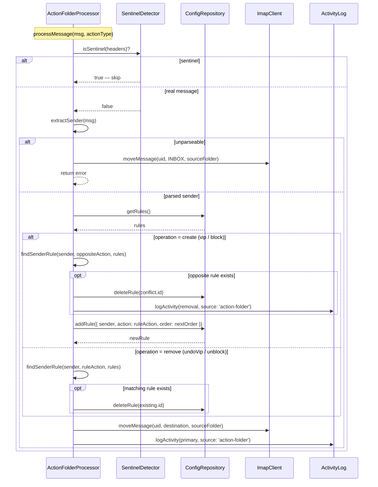

## Participants

- **ActionFolderProcessor** (MOD-0018) — orchestrates the rule mutation and message move for a single action folder message.
- **SentinelDetector** (MOD-0003) — guards the entry point so sentinel messages are never treated as user actions.
- **ConfigRepository** (MOD-0014) — exposes current rules, performs `addRule`/`deleteRule`, generates the next order value, and resolves action-folder destinations from config.
- **ImapClient** (MOD-0002) — moves the dragged message from its action folder to either INBOX or the trash folder.
- **ActivityLog** (MOD-0007) — records each rule mutation (creation, removal) and message move with `source: 'action-folder'`.

## Named Interactions

- **IX-008.1** — Sentinel guard: SentinelDetector checks the message headers; sentinels are logged and skipped before any rule logic.
- **IX-008.2** — Sender extraction: `extractSender(message)` reads `From` and produces a lowercased bare email; an unparseable address triggers an early recovery path (move message to INBOX, log error, return failure).
- **IX-008.3** — Action lookup: the dispatched ActionType (`vip` | `block` | `undoVip` | `unblock`) is resolved against `ACTION_REGISTRY` to produce `{ operation, ruleAction, destination, folderConfigKey }`.
- **IX-008.4** — Conflict detection (create operations only): `findSenderRule(sender, oppositeRuleAction, rules)` looks for an existing sender-only rule of the opposite action type. A hit is removed via `ConfigRepository.deleteRule()` before the new rule is created, and the removal is logged as its own activity entry.
- **IX-008.5** — Rule creation: for `vip`/`block` the processor calls `ConfigRepository.addRule({ name, match: { sender }, action: { type: ruleAction }, enabled: true, order: nextOrder() })`. The rule name follows the pattern `"VIP: <sender>"` or `"Block: <sender>"`.
- **IX-008.6** — Rule removal: for `undoVip`/`unblock` the processor calls `findSenderRule(sender, ruleAction, rules)` to locate the matching sender-only rule and removes it via `ConfigRepository.deleteRule()`. If no such rule exists, the processor proceeds to message recovery without raising an error.
- **IX-008.7** — Multi-field rule preservation: `isSenderOnly()` distinguishes sender-only rules from richer rules sharing the same sender. Multi-field rules are never removed by an action folder operation; the new sender-only rule is appended after them and matches at lower priority.
- **IX-008.8** — Destination resolution: the abstract destination from the registry (`'inbox'` | `'trash'`) is resolved at runtime — INBOX uses the configured INBOX path, trash uses the configured trash folder from the review config.
- **IX-008.9** — Message move: `ImapClient.moveMessage(uid, destination, sourceFolder)` moves the dragged message out of the action folder. Move failures are logged but do not roll back the rule mutation.
- **IX-008.10** — Activity logging: a final `ActivityLog.logActivity(...)` entry is written with `source: 'action-folder'`, the action type, the resulting (or removed) rule's ID, the destination folder, and a success/error flag. Conflict removals in IX-008.4 produce their own activity entry in addition to the primary entry.

## Sequence Diagram

## Preconditions

- The message has been dispatched here by IX-007 with a known `ActionType`.
- ConfigRepository is initialized and reflects the current persisted rule set.
- ImapClient holds a live IMAP session and the action folder is currently selectable.

## Postconditions

- For create operations (`vip`/`block`): a new sender-only rule of the appropriate action type exists, named per convention, with the next available order value. Any conflicting opposite-action sender-only rule has been removed.
- For remove operations (`undoVip`/`unblock`): the matching sender-only rule has been removed if present; otherwise the rule set is unchanged.
- The dragged message is no longer in the action folder — it has been moved to INBOX (vip/undoVip/unblock or unparseable recovery) or to the trash folder (block).
- One or two activity log entries with `source: 'action-folder'` describe what happened (one for the primary action, plus a second one when a conflict was resolved).
- Multi-field rules sharing the action's sender are untouched.

## Failure Handling

None defined yet.

## Notes

- The `findSenderRule` and `isSenderOnly` helpers live in `src/rules/sender-utils.ts`. They have no MOD-#### spec of their own; they are utilities used by the processor (MOD-0018).
