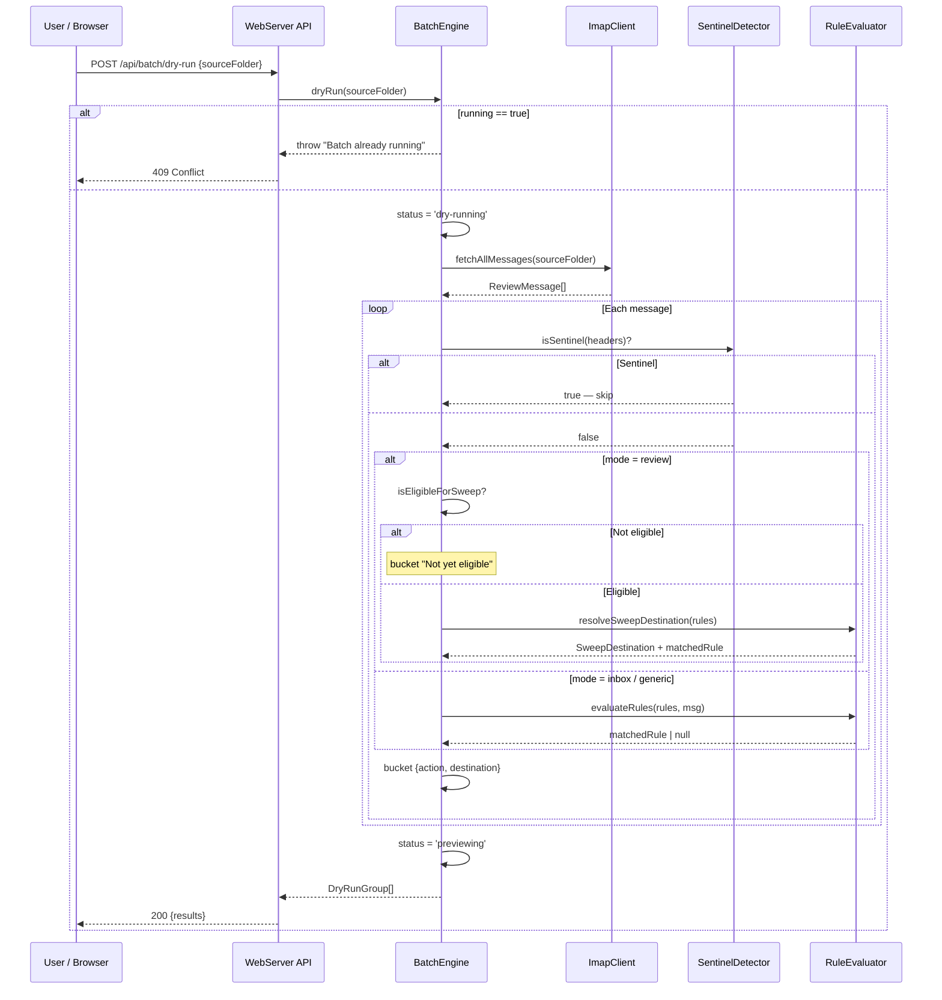

## Participants

- **WebServer API** — receives the dry-run request from the user's browser.
- **BatchEngine** — orchestrates the dry-run: fetch, guard, evaluate, group results.
- **ImapClient** — fetches all messages from the source folder.
- **SentinelDetector** — guards against including sentinel messages in the preview.
- **RuleEvaluator** — evaluates rules against each non-sentinel message in inbox/generic mode.
- **ReviewSweeper helpers** — `isEligibleForSweep` and `resolveSweepDestination` are reused in review-folder mode.

## Named Interactions

- **IX-009.1** — User submits `POST /api/batch/dry-run` with `{ sourceFolder }`. WebServer validates with Zod and calls `BatchEngine.dryRun(sourceFolder)`.
- **IX-009.2** — BatchEngine guards against concurrent runs (throws `"Batch already running"` if `running === true`); WebServer maps that to HTTP 409.
- **IX-009.3** — BatchEngine sets `state.status = 'dry-running'`, fetches all messages from the source folder via ImapClient.
- **IX-009.4** — BatchEngine selects a processing mode based on `sourceFolder`:
    - `inbox` if `sourceFolder === 'INBOX'` — uses arrival-style rule evaluation; review-action rules resolve to the configured Review folder.
    - `review` if `sourceFolder === reviewFolder` — uses sweep-style eligibility and `resolveSweepDestination` (default-archive fallback applies).
    - `generic` otherwise — uses arrival-style evaluation but never falls back to the Review folder.
- **IX-009.5** — Each message is checked against SentinelDetector. Sentinels are skipped silently and not counted.
- **IX-009.6** — In `inbox`/`generic` mode, RuleEvaluator returns the matched rule (or null). The destination is derived from the rule's action via `resolveDestination`. Unmatched messages are bucketed under the `no-match` key.
- **IX-009.7** — In `review` mode, `isEligibleForSweep(msg, sweepConfig, now)` runs first. Ineligible messages are bucketed under "Not yet eligible" with action `skip`. Eligible messages flow through `resolveSweepDestination`, defaulting to `defaultArchiveFolder` when no rule matches.
- **IX-009.8** — Results are grouped by `{action, destination}` keys into `DryRunGroup[]`. Each group lists count and example messages (uid, from, subject, date, ruleName).
- **IX-009.9** — BatchEngine sets `state.status = 'previewing'`, stores the groups in `state.dryRunResults`, and returns them in the HTTP response.

## Sequence Diagram

## Preconditions

- BatchEngine is in `idle` state (or any non-running terminal state).
- The source folder exists on the IMAP server.
- ConfigRepository has loaded the current rule set into BatchEngine.

## Postconditions

- On success: `BatchEngine.state.dryRunResults` holds the grouped preview, `state.status === 'previewing'`, `running === false`. The response payload mirrors the stored groups.
- On concurrent-run rejection: state is unchanged; the user receives a 409.
- On fetch error: `state.status = 'error'`, the error propagates to WebServer as a 500.

## Failure Handling

- **Concurrent run** — `running === true` causes BatchEngine to throw before any work; the in-flight run is undisturbed.
- **IMAP fetch failure** — caught in the outer `try`; sets `state.status = 'error'` and re-throws so WebServer can return 500.
- **Sentinel inclusion regression** — protected at the per-message guard. A sentinel slipping into the preview would mislead users; the guard MUST run before any grouping or counting.
