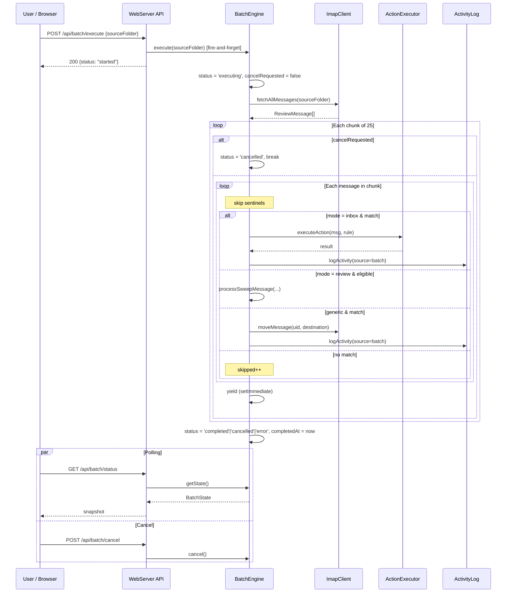

## Participants

- **WebServer API** — receives execute, cancel, and status requests; returns immediately on execute (fire-and-forget).
- **BatchEngine** — runs the chunked processing loop, observes the cancel flag between chunks, updates `BatchState`.
- **ImapClient** — fetches messages and performs MOVE operations.
- **SentinelDetector** — guards each per-message iteration.
- **RuleEvaluator** — evaluates rules per message in inbox/generic mode.
- **ActionExecutor** — performs the IMAP action in inbox mode (delegates move/review/skip/delete).
- **ReviewSweeper helpers** — `isEligibleForSweep` and `processSweepMessage` are reused in review-folder mode.
- **ActivityLog** — records each per-message outcome with `source: 'batch'`.

## Named Interactions

- **IX-010.1** — User submits `POST /api/batch/execute` with `{ sourceFolder }`. WebServer validates, calls `BatchEngine.execute(sourceFolder)` *without awaiting*, and returns `{ status: 'started' }` immediately.
- **IX-010.2** — BatchEngine guards against concurrent runs (throws `"Batch already running"` if `running === true`); WebServer maps that to HTTP 409 only in the synchronous portion. The fire-and-forget `.catch` logs unhandled errors but cannot reach the client.
- **IX-010.3** — BatchEngine resets state to `executing`, clears `cancelRequested`, fetches all messages from the source folder, and selects a processing mode (inbox / review / generic — same rules as IX-009).
- **IX-010.4** — Messages are processed in chunks of 25. Between chunks, BatchEngine yields with `setImmediate` so the event loop can service `GET /api/batch/status` polls and `POST /api/batch/cancel` requests.
- **IX-010.5** — Before starting each chunk, BatchEngine checks `cancelRequested`. If set, it transitions `state.status = 'cancelled'`, sets `state.cancelled = true`, and breaks out of the loop. The current chunk completes — cancel is cooperative, not preemptive.
- **IX-010.6** — Per-message handling:
    - **Sentinel** → skipped silently.
    - **review mode, not eligible** → `state.skipped++`, `state.processed++`, no IMAP op.
    - **review mode, eligible** → delegate to `processSweepMessage` (with `source: 'batch'`), increment `moved` or `errors`.
    - **inbox mode, no match** → `state.skipped++`, no IMAP op.
    - **inbox mode, match** → delegate to `executeAction` (IX-002 path); skip results count as `skipped`, success as `moved`, failure as `errors`. ActivityLog records the outcome.
    - **generic mode, no match** → `state.skipped++`.
    - **generic mode, match** → resolve destination via `resolveDestination`, perform `client.moveMessage` directly (or count as skipped if destination is the special "Skip" sentinel), log to ActivityLog with the appropriate result shape.
- **IX-010.7** — Per-message errors are caught locally: `state.errors++`, log entry written with `success: false`, the loop continues. A per-message error never aborts the run.
- **IX-010.8** — After the last chunk (or on cooperative cancel), BatchEngine sets `state.status` to `'completed'` (if not already `'cancelled'` or `'error'`), records `state.completedAt`, releases `running`, and returns a `BatchResult` summary.
- **IX-010.9** — `GET /api/batch/status` returns the current `BatchState` snapshot at any time. The frontend polls this to render progress and detect completion.

## Sequence Diagram

## Preconditions

- BatchEngine is in `idle` state.
- The source folder exists on the IMAP server.
- The current rule set is loaded; trash folder, review folder, and review config are configured (used by inbox/review modes).

## Postconditions

- On `completed`: every non-sentinel message in the source folder has been processed; counters reflect the run; per-message activity entries exist with `source: 'batch'`.
- On `cancelled`: the chunk in progress at cancel-request finished, subsequent chunks did not run; counters reflect the partial run; remaining messages are untouched.
- On `error`: the outer fetch failed; per-message processing did not start; `state.status === 'error'`. Per-message errors do *not* set `error` status — they bump `state.errors` instead.
- `BatchEngine.running === false` and `state.completedAt` is set in all terminal cases.

## Failure Handling

- **Concurrent run** — see IX-010.2.
- **IMAP fetch failure (outer)** — caught, `state.status = 'error'`, `BatchResult` returned with the partial counters; the fire-and-forget `.catch` in WebServer logs the error.
- **Per-message IMAP failure** — caught in the inner loop; counted as `errors`; logged to ActivityLog with `success: false` and the error string. Run continues.
- **FM-001 risk** — BatchEngine performs many IMAP MOVE operations on a non-INBOX folder. Each `moveMessage` call goes through MOD-0002, which is responsible for INBOX restoration on completion (see INV-001). BatchEngine itself does not select folders — it relies on `moveMessage`'s own folder handling — so the IDLE-stranding risk is bounded to MOD-0002's contract.
