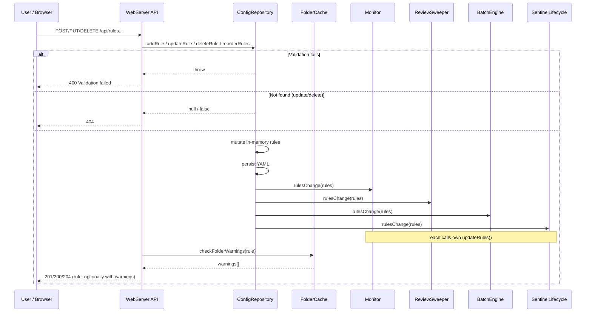

## Participants

- **WebServer API** — receives `POST/PUT/DELETE /api/rules*` requests and delegates to ConfigRepository.
- **ConfigRepository** — validates input against `ruleSchema`, mutates the in-memory rule list, persists the YAML config file, and fires the `rulesChange` listener.
- **FolderCache** — consulted on create/update to attach a warning when the destination folder is not present in the cached folder tree.
- **Monitor / ReviewSweeper / BatchEngine / SentinelLifecycle** — subscribers to `rulesChange` that hot-swap their internal rule references and (for SentinelLifecycle) reconcile sentinel placement.

## Named Interactions

- **IX-011.1** — User submits a rule mutation:
    - `POST /api/rules` (create) — body is a `Rule` without `id`. `order` is required by `ruleSchema` (a non-negative integer); the route does not default it. Frontend callers compute the next order client-side or via a prior `GET /api/rules`.
    - `PUT /api/rules/{id}` (update) — body is a full `Rule` (without `id`).
    - `DELETE /api/rules/{id}` (delete).
    - `PUT /api/rules/reorder` — body is an array of `{id, order}` pairs.
    - `DELETE /api/rules?namePrefix=...` (bulk delete by name prefix; minimum 2 chars).
- **IX-011.2** — WebServer parses the body and calls the corresponding `ConfigRepository` method.
- **IX-011.3** — ConfigRepository validates the input against `ruleSchema`. On validation failure, it throws; WebServer maps to HTTP 400 with `{ error: "Validation failed", details: [...] }`.
- **IX-011.4** — On success, ConfigRepository mutates the in-memory rule list:
    - `addRule` generates a UUID for `id` and appends. `order` is required by `ruleSchema` and must be supplied in the body — there is no defaulting in `addRule` itself. Callers that need a default order (e.g. `proposed-rules.ts`, the action-folder processor) call `ConfigRepository.nextOrder()` explicitly before invoking `addRule`. The persisted `order` round-trips back in the route's response payload.
    - `updateRule` replaces the existing rule by id; returns null if not found (WebServer → 404).
    - `deleteRule` removes by id; returns false if not found (WebServer → 404).
    - `reorderRules` applies the order updates atomically (unknown ids are ignored).
- **IX-011.5** — ConfigRepository persists the full updated rule list to YAML synchronously, then fires the `rulesChange` listener with the new rule array.
- **IX-011.6** — A single registered `rulesChange` callback fans out to:
    - `Monitor.updateRules(rules)` — next arrival uses the new rule set.
    - `ReviewSweeper.updateRules(rules)` — next sweep tick uses the new rule set (only invoked when a sweeper instance exists).
    - `BatchEngine.updateRules(rules)` — affects the *next* batch chunk; an in-flight chunk completes against its captured array.
    - `reconcileSentinels(tracked, ...)` — when sentinels are enabled, the callback re-collects tracked folders from the updated config and asynchronously plants/removes sentinels for any rule-target folders that gained or lost references. Errors are logged but do not surface to the user.
- **IX-011.7** — For create/update, WebServer calls `checkFolderWarnings(rule, folderCache)` after persistence. If the rule's destination folder is not in the cached tree, the response payload is augmented with `warnings: [...]`. This does not prevent rule creation — folders may legitimately be auto-created by IX-002.6 on first action.
- **IX-011.8** — WebServer returns the updated/created rule (201 for create, 200 for update/reorder, 204 for delete).

## Sequence Diagram

## Preconditions

- WebServer is running and ConfigRepository has loaded the existing config from YAML.
- All hot-reload subscribers have registered via `onRulesChange` at startup.

## Postconditions

- The YAML file on disk reflects the change.
- All processing subsystems hold the new rule set (or the reduced set after a delete).
- The HTTP response reflects the persisted state, with optional folder warnings.
- No IMAP reconnection occurred. Sentinel topology may have changed (lifecycle reconciliation), but the IMAP session is otherwise undisturbed.

## Failure Handling

- **Validation failure** — IX-011.3, returns 400, no mutation, no listener fired.
- **Stale id** — IX-011.4 returns null/false, WebServer maps to 404.
- **YAML write failure** — bubbles up as a 500. Note that the in-memory mutation has already happened by then; the next process restart would lose the change. This is a known gap (no rollback path); it is acceptable because YAML writes against a local file rarely fail outside disk-full conditions.
- **Listener exception** — a throwing subscriber should not undo the rule change. Current code does not isolate listeners; a thrown listener could mask others. Hardening this is out of scope here.
