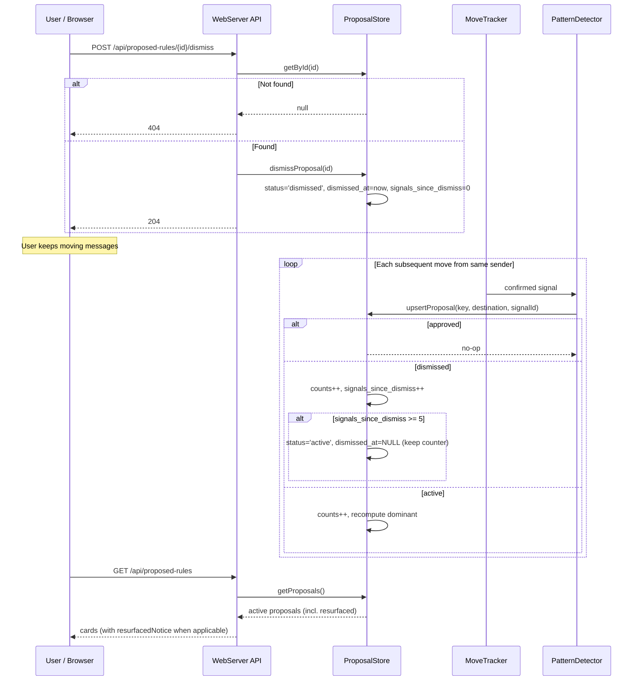

## Participants

- **WebServer API** — receives `POST /api/proposed-rules/{id}/dismiss` from the user's browser.
- **ProposalStore** — mutates the proposal row (dismissal) and applies the resurfacing rule on each subsequent signal.
- **PatternDetector** — feeds new move signals into ProposalStore via `upsertProposal`, including for dismissed proposals.
- **MoveTracker / DestinationResolver / SignalStore** — upstream sources of confirmed user-move signals (see IX-003, IX-004). Their behavior is unchanged for dismissed proposals.

## Named Interactions

- **IX-012.1** — User submits `POST /api/proposed-rules/{id}/dismiss`. WebServer parses the id, calls `ProposalStore.getById(id)` first; on null returns 404 without mutation.
- **IX-012.2** — On hit, WebServer calls `ProposalStore.dismissProposal(id)`. The store sets `status = 'dismissed'`, `dismissed_at = now`, `signals_since_dismiss = 0`, and updates `updated_at`. Returns 204.
- **IX-012.3** — `getProposals()` returns only `status = 'active'` rows, so the dismissed proposal disappears from the proposed-rules list immediately.
- **IX-012.4** — Independently, the user continues moving messages from the same sender. MoveTracker → DestinationResolver → SignalStore records each signal; PatternDetector calls `ProposalStore.upsertProposal(key, destination, signalId)` per signal (IX-004).
- **IX-012.5** — `upsertProposal` looks up the proposal by key (sender + envelopeRecipient + sourceFolder). If the proposal is `approved`, the upsert is a no-op (returns immediately). If `dismissed`, the upsert proceeds with the resurfacing rule.
- **IX-012.6** — Resurfacing rule (per signal applied to a dismissed proposal):
    - `destination_counts[destination]` is incremented; dominant destination is recomputed.
    - `matching_count` and `contradicting_count` are recalculated from the destination map.
    - `signals_since_dismiss` is incremented by 1.
    - If `signals_since_dismiss >= 5`, `status` flips to `'active'` and `dismissed_at` is cleared. `signals_since_dismiss` is *not* reset — it remains so `resurfacedNotice` in the card builder can display "Previously dismissed — N new moves since then."
- **IX-012.7** — On the next `GET /api/proposed-rules`, the resurfaced proposal is included in the active list. The strength label reflects cumulative `matchingCount` (pre + post dismissal). The card builder includes `resurfacedNotice` when `status === 'active' && signalsSinceDismiss > 0`.

## Sequence Diagram

## Preconditions

- The proposal exists and is `active` at dismissal time. (Dismissing an already-dismissed or already-approved proposal is harmless: an approved proposal's status is overwritten — see Failure Handling.)
- PatternDetector is running and connected to MoveTracker's signal stream.

## Postconditions

- After dismissal: the proposal row has `status = 'dismissed'`, `dismissed_at` set, `signals_since_dismiss = 0`. The proposal does not appear in `getProposals()` until resurfaced.
- After 5 post-dismissal signals: the row has `status = 'active'`, `dismissed_at = NULL`, `signals_since_dismiss = 5` (preserved for UI). The proposal is listed with a resurfaced notice and the cumulative count.
- ActivityLog is *not* touched by dismissal or resurfacing — these mutations are confined to `proposed_rules`. The signals themselves are recorded in `move_signals` per IX-004.

## Failure Handling

- **Dismiss of non-existent proposal** — returns 404 without mutation.
- **Dismiss of an already-approved proposal** — current `dismissProposal` overwrites `status` and `dismissed_at` regardless of prior state. This is a latent issue (it would orphan the `approved_rule_id` link). The web flow guards against it because the UI only shows active proposals to dismiss; calling the endpoint with a stale id for an approved proposal is the only way to trigger this. Explicit guarding is out of scope for this IX but worth flagging.
- **Concurrent signals during dismiss** — both transactions touch the same row. SQLite's serialized writes mean one wins; the resurfacing counter is consistent regardless of order. The first signal after dismiss will see `signals_since_dismiss = 1`.
